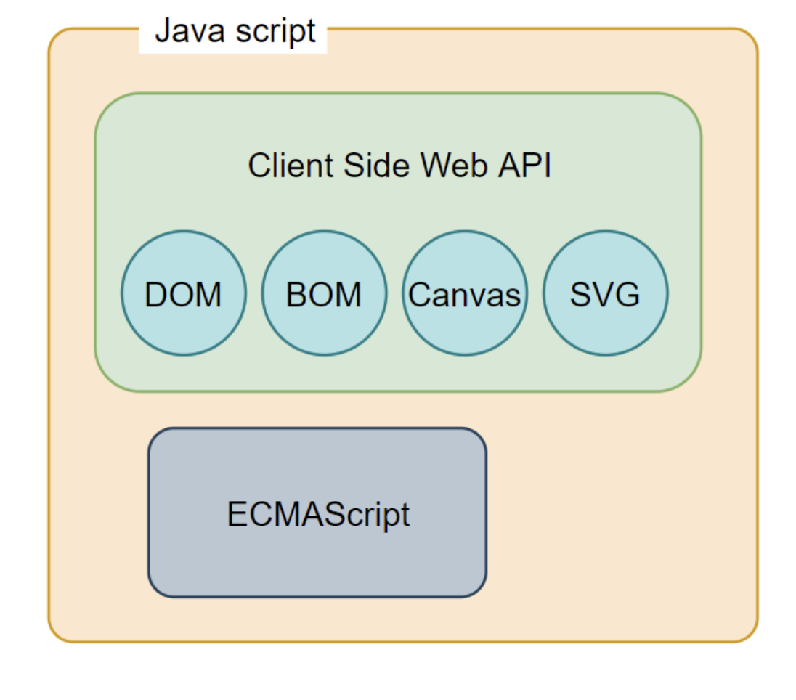

**프로토타입 기반의 객체지향 언어**

### Node.js

- Node.js는 **비동기 I/O**를 지원하며 **단일 스레드 이벤트 루프** 기반으로 동작함으로써 요청 처리 성능이 좋음
- 데이터를 실시간으로 처리하기 위해 I/O가 빈번하게 발생하는 SPA에 적합
  - but, CPU 사용률이 높은 애플리케이션에서는 권장하지 않음

> CBD: Component-based-development

Javascript = ECMAScript + Client Side Web API

| 컴파일러 언어                                                  | 인터프리터 언어(JS)                                                 |
| -------------------------------------------------------------- | ------------------------------------------------------------------- |
| 컴파일 타임에 소스코드 전체를 한 번에 머신 코드로 변환 후 실행 | 런타임에 한 줄씩 바이트코드로 변환 후 실행                          |
| 실행 파일을 생성                                               | 실행 파일을 생성하지 않음                                           |
| 컴파일 단계와 실행 단계가 분리                                 | 인터프리트 단계와 실행 단계가 분리되어 있지 않음                    |
| 컴파일은 단 한 번 수행                                         | 코드가 실행될 때마다 인터프리트 과정이 반복 수행                    |
| 단계의 분리로 인해 코드 실행 속도가 비교적 빠름                | 단계가 분리되어 있지 않고 반복 수행으로 인해 실행속도가 비교적 느림 |
