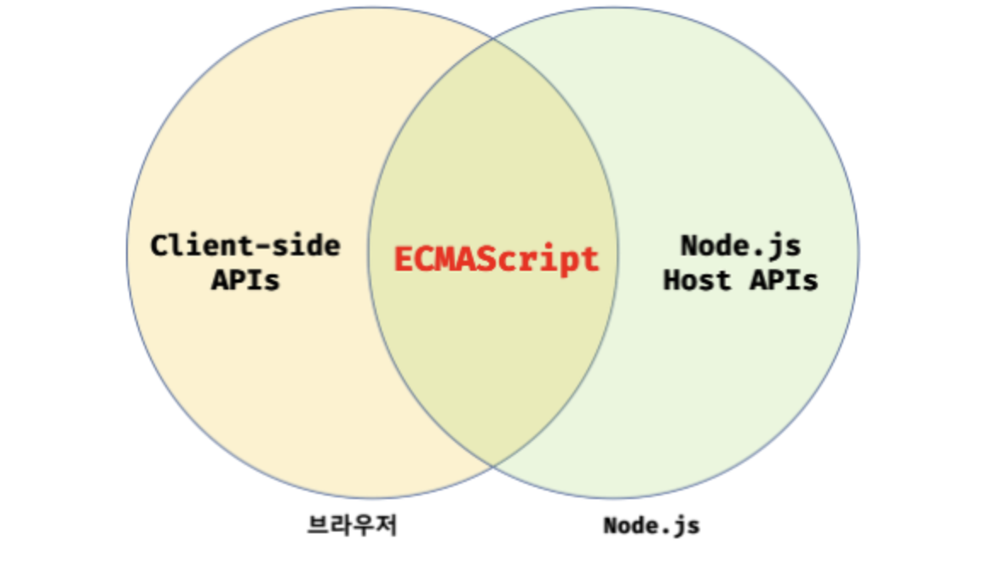

### 자바스크립트 실행 환경

브라우저와 Node.js 모두 자바스크립트의 코어인 ECMAScript를 실행할 수 있지만, 브라우저와 Node.js에서 **ECMAScript 이외의 추가로 제공하는 기능은 호환되지 않음**

콘솔 & 디버깅

- [Tools for Web Developers: 콘솔 사용](https://developers.google.com/web/tools/chrome-devtools/console/?hl=ko)
- [Tools for Web developers: Chrome DevTools에서 자바스크립트 디버깅 시작하기](https://developers.google.com/web/tools/chrome-devtools/javascript/?hl=ko)
