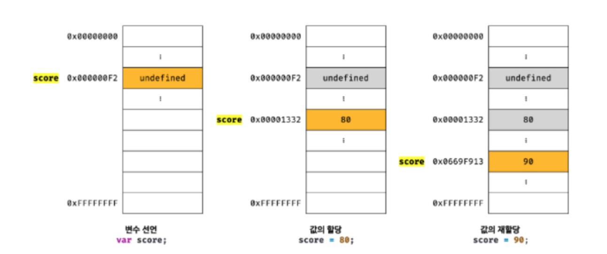

자바스크립트는 개발자의 직접적인 메모리 제어를 허용하지 않음

- 값이 저장될 메모리주소는 코드가 실행될 때 메모리 상황에 따라 임의로 결정
- 변수를 통해 메모리 공간에 접근

### 변수 선언

**선언 단계**: 변수 이름을 등록해서 자바스크립트 엔진에 변수의 존재를 알림
**초기화 단계**: 값을 저장하기 위한 메모리 공간을 확보하고 암묵적으로 `undefined`를 할당해 초기화

> 변수 이름은 어디에 등록되는가?
> 모든 식별자는 실행 컨텍스트에 등록된다. 실행 컨텍스트는 자바스크립트 엔진이 소스코드를 평가하고 실행하기 위해 필요한 환경을 제공하고 코드의 실행 결과를 실제로 관리하는 영역
>
> 변수 이름과 변수 값은 실행 컨텍스트 내에 `key/value` 형식인 객체로 등록되어 관리

### 변수 선언의 실행 시점과 변수 호이스팅

```js
console.log(score); // undefined

var score = 80;

console.log(score); // 80
```

- **변수 선언은 런타임이 아닌 그 이전 단계에서 먼저 실행**
- 값의 할당은 런타임에 실행
- 값을 할당할 때는 기존 메모리 공간을 사용하는 것이 아닌, **새로운 메모리 공간을 확보하고 그곳에 값을 할당**
- 불필요한 값(어떠한 식별자도 참조하지 않는 메모리 공간)들은 가비지 콜렉터에 의해 메모리에서 자동 해제



> 네이밍 컨벤션

```js
var camelCase; // 카멜 케이스

var snake_case; // 스네이크 케이스

var PascalCase; // 파스칼 케이스

var typeHungarianCase; // 헝카리언 케이스(type + identifier)
```
