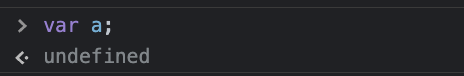

값: 표현식(expression)이 평가되어 생성된 결과

- 평가: 식을 해석해서 값을 생성하거나 참조하는 것

모든 값은 데이터 타입을 가지며 타입에 따라 다르게 해석 됨

- `0100 0001`(`char`): 'A'
- `0100 0001`(`int`): '65'

### 리터럴

**리터럴**: 사람이 이해할 수 있는 문자 또는 약속된 기호를 사용해 값을 생성하는 표기법

| 리터럴      | 예시                                  | 비고                      |
| ----------- | ------------------------------------- | ------------------------- |
| 정수        | `100`                                 |                           |
| 부동소수점  | `10.5`                                |                           |
| 2진수       | `0b01000001`                          | `0b`로 시작               |
| 8진수       | `0o101`                               | ES6에서 도입, `0o`로 시작 |
| 16진수      | `0x41`                                | ES6에서 도입, `0x`로 시작 |
| 문자열      | `'Hello'`, `"World"`                  |                           |
| Boolean     | `true`, `false`                       |                           |
| null        | `null`                                |                           |
| undefined   | `undefined`                           |                           |
| 객체        | `{ name : 'Sim', address : 'Seoul' }` |                           |
| 배열        | `[ 1, 2, 3 ]`                         |                           |
| 함수        | `function() {}`                       |                           |
| 정규 표현식 | `/[A-Z]+/g`                           |                           |

### 표현식

**표현식**: 값으로 평가될 수 있는 문(statement)

```js
// 리터럴 표현식
10;
("Hello");

// 식별자 표현식(선언이 되어있다고 가정)
sum;
person.name;
arr[1];

// 연산자 표현식
10 + 20;
sum !== 10;

// 함수 호출 표현식(선언이 되어있다고 가정)
square();
person.getName();
```

### 세미콜론 & 세미콜론 자동 삽입 기능

Q) 자바스크립트에서 세미콜론을 생략할 수 있는 이유?

> 자바스크립트 엔진이 소스코드를 해석할 때 문의 끝이라고 예측되는 지점에 세미콜론을 자동으로 붙여주는
> **세미콜론 자동 삽입 기능(ASI: automatic semicolon insertion)**이 암묵적으로 수행되기 때문이다.

### 표현식인 문과 표현식이 아닌 문

**가장 간단한 구별법: 변수에 할당해보기**

```js
var foo = var x;    // Uncaught SyntaxError: Unexpected token 'var'

var bar = x = 100;
console.log(bar);   // 100
```

**완료 값(completion value)**

- 크롬 개발자 도구에서 **표현식이 아닌 문**을 실행하면 `undefined`를 출력
  - 완료 값은 표현식의 평가 결과가 아님.
  - 
- 크롬 개발자 도구에서 **표현식인 문**을 실행하면 평가된 값을 반환
  - 
