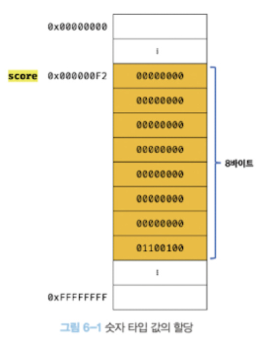

<table border="1" bordercolor="#2284f5">
 <th width="100" bgcolor="#7ab5f9">구분</th>
 <th width="150" bgcolor="#7ab5f9">데이터 타입</th>
 <th width="400"bgcolor="#7ab5f9">설명</th>
  <tr align="center">
    <td rowspan="7" align="center">원시 타입</td>
    <td>숫자 타입</td>
	<td align="left">&nbsp;숫자, 정수와 실수 구분 없이 하나의 숫자 타입만 존재</td>
  </tr>
    <tr align="center">
    <td>BigInt 타입</td>
	<td align="left">&nbsp;2^53 - 1보다 큰 정수를 표현할 수 있는 값</td>
  </tr>
  <tr align="center">
    <td >문자열 타입</td>
	<td  align="left">&nbsp;문자열</td>
  </tr>
  <tr align="center">
    <td>boolean 타입</td>
	<td align="left">&nbsp;논리적 참(true)과 거짓(false)</td>
  </tr>
   <tr align="center">
    <td>undefined 타입</td>
	<td align="left">&nbsp;var키워드로 선언된 변수에 암묵적으로 할당되는 값</td>
  </tr>
   <tr align="center">
    <td>null 타입</td>
	<td align="left">&nbsp;값이 없다는 것을 의도적으로 명시할 때 사용하는 값</td>
  </tr>
 <tr align="center">
    <td>symbol 타입</td>
	<td align="left">&nbsp;ES6에서 추가된 7번째 타입</td>
  </tr>
  <tr>
	  <td colspan="2" align="center">객체 타입</td>
	  <td>&nbsp;객체, 함수, 배열 등</td>
  </tr>
</table>

### 숫자 타입

- 자바스크립트는 다른 언어와는 다르게 하나의 숫자 타입만 존재
- ECMAScript 사양에 따르면 숫자 타입의 값은 배정밀도 64bit 부동소수점 형식
  - 모든 수를 실수로 처리하며, 정수만 표현하기 위한 데이터 타입이 별도로 존재x
  - 정수, 실수, 2진수, 8진수, 16진수 리터럴은 모두 배정밀도 64bit 부동소수점 형식으로 저장
- 특별한 값
  - `Infinity`: 양의 무한대
  - `-Infinity`: 음의 무한대
  - `NaN`: 산술 연산 불가(Not-a-Number)

```js
var binary = 0b01000001; // 2진수
var octal = 0o101; // 8진수
var hex = 0x41; // 16진수

console.log(binary); // 65
console.log(octal); // 65
console.log(hex); // 65
console.log(binary === octal); // true
console.log(octal === hex); // true
console.log(hex === binary); // true

// 숫자 타입은 모두 실수로 처리
console.log(1 === 1.0); // true
```

### 문자열 타입

- 문자열을 0개 이상의 16bit 유니코드 문자(UTF-16)의 집합으로 전 세계 대부분의 문자 표현 가능
- 작은따옴표(`''`), 큰따옴표(`""`) 또는 백틱(\` \`) 으로 텍스트를 감싸서 사용

### 템플릿 리터럴

- 런타임에 일반 문자열로 변환되어 처리
- 멀티라인 문자열, 표현식 삽입, 태그드 템플릿 등 편리한 문자열 처리기능 제공

### undefined 타입

변수 선언에 의해 확보되는 메모리 공간을 처음 할당이 이뤄질 때까지 쓰레기 값이 아닌 `undefined`로 자바스크립트 엔진이 초기화

> 개발자가 의도적으로 변수에 `undefined`를 할당하는 것은 본래 취지와 어긋날뿐더러 혼란을 줄 수 있으므로 권장하지 않는다.
> 변수에 값이 없다는 것을 명시하고 싶을 때는 `undefined`가 아닌 `null`을 할당하자!

### null 타입

`null`은 변수에 값이 없다는 것을 의도적으로 명시(의도적 부재, intentional absence)할 때 사용

- 이전에 할당되어 있던 값에 대한 참조를 명시적으로 제거
- 자바스크립트 엔진은 누구도 참조하지 않는 메모리 공간에 대해 가비지 콜렉션을 수행
- 함수가 유효한 값을 반환할 수 없는 경우 명시적으로 `null`을 반환하기도 한다
  - ex. `document.querySelector`을 통해 조건에 부합하는 HTML요소를 찾지 못한 경우

### Symbol 타입

- 다른 값과 중복되지 않는 유일무이한 값
- 변경 불가능한 원시 타입의 값
- 이름 충돌할 위험이 없는 객체의 유일한 프로퍼티 키를 만들기 위해 사용
- `Symbol`함수를 호출해 생성

### 데이터 타입에 의한 메모리 공간의 확보와 참조

메모리에 값을 저장하려면 먼저 확보해햐 할 메모리 공간의 크기를 결정해야함
자바스크립트 엔진은 데이터 타입에 따라 정해진 크기의 메모리 공간을 확보



※ ECMAScript 사양은 문자열과 숫자 타입 외의 데이터 타입의 크기를 명시적으로 규정하고 있지는 않음

> 값의 참조의 경우, 한 번에 읽어 들여야할 메모리 공간의 크기, 즉 메모리 셀의 개수(바이트 수)를 알아야 하는데 자바스크립트 엔진의 경우 위의 사진에서의 score 변수를 숫자 타입으로 인식하며, 숫자 타입은 8byte 단위로 저장되므로 8byte 단위로 메모리 공간에 저장된 값을 읽어들임

※ **심벌 테이블** : 컴파일러 또는 인터프리터는 심벌 테이블이라고 부르는 자료구조를 통해 식별자를 키로 바인딩된 값의 메모리 주소, 데이터 타입, 스코프 등을 관리

### 동적 타이핑(dynamic typing)

- 자바스크립트의 변수는 선언이 아닌 할당에 의해 타입이 결정(타입 추론, type inference)
- 재할당에 의해 변수 타입은 언제든지 동적으로 변할 수 있음

동적 타입 언어는 유연성은 높지만, 신뢰성은 떨어짐
신뢰성을 높이기 위한 5가지 방법

1. 변수는 꼭 필요한 경우에 한해 제한적으로 사용
   - 변수 개수가 많을수록 오류가 발생할 확률↑
2. 변수의 유효 범위(스코프)는 최대한 좁게 만들어 변수의 부작용을 억제
3. 전역 변수는 최대한 사용하지 않기
4. 변수보다는 상수를 사용해 값의 변경을 억제
5. 변수 이름은 변수의 목적이나 의미를 파악할 수 있도록 네이밍
